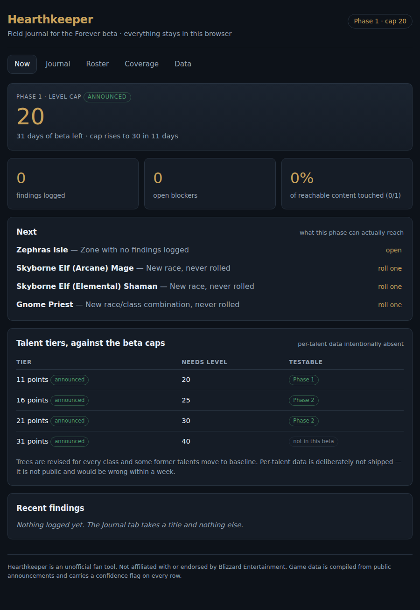
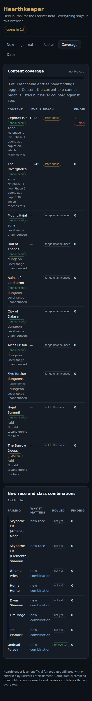

# Hearthkeeper

A local-first field companion for the **World of Warcraft: Forever** (Classic+) beta —
September 17 to October 21, 2026.

**[Open the app →](https://rporter33.github.io/hearthkeeper/)** · works offline, installs as a
PWA, and never sends anything anywhere.



---

It does three things a beta tester actually needs and the game client does not do:

1. **Catches findings before you lose them.** A title is enough to log one; severity, zone,
   level, character, steps and expected/actual are optional and can be filled in later. A
   near-duplicate of something you already logged in the same place is caught on the way in.
2. **Tells you what is worth testing right now.** The beta runs at a level 20 cap and then a
   level 30 cap, so most of the announced content is out of reach for the whole test. Coverage
   is scored against what the live phase can actually reach, never against the full patch.
3. **Writes the report for you.** Findings export as forum-ready markdown, grouped by severity,
   steps renumbered, stamped with the build they were seen on.

Everything runs in the browser. No accounts, no server, no analytics, no network calls at all.
Your journal is a JSON file you export and own.

## The thing most worth knowing

Talent points start at level 10, one per level. So the phase 1 cap of 20 is exactly 11 points —
the first talent tier. Forever's **new 16-point tier needs level 25**, which only exists after
the cap rises to 30 in phase 2. A tester who stops at the phase 1 cap never sees the headline
change to the talent system. The app computes that from two numbers and puts it on the
dashboard.

The same arithmetic runs over content. Of three announced zones one is a 1–12 starting area,
one is 30–45 and barely reachable at the beta's final cap, and one has no announced level range
at all. No raid is testable. So unreachable content is listed with the reason and left out of
the coverage denominator — a completion number that can only go down is a number people stop
reading.



## Running it

```bash
npm install
npm run dev      # local dev server
npm test         # 84 unit tests over the core logic
npm run build    # static build in dist/, deployable to any static host

npm run smoke    # end-to-end browser checks against dist/ (needs: npm i -D playwright)
```

`vite.config.js` sets `base: "./"`, so a build works under a subpath — GitHub Pages, Cloudflare
Pages, or a folder on a NAS — with no config change. Pushing to `main` builds, runs the tests,
and deploys to Pages via `.github/workflows/pages.yml`.

## Layout

```
src/core/     pure logic, no React — schedule, talents, journal, coverage, report, storage
src/ui/       the views: dashboard, journal, roster, coverage, data
src/data/     versioned content packs (game facts, each row carrying a confidence flag)
scripts/      end-to-end smoke test
```

The split matters: every rule the app enforces — which phase is live, what a level cap can
reach, whether a race/class pairing is legal, what a report looks like — is a pure function
under `src/core/` and is unit-tested without mounting a component.

See [ARCHITECTURE.md](ARCHITECTURE.md) for the decisions and the standing trade-offs.

## On the game data

Every zone, dungeon, raid, phase and talent tier in `src/data/` carries a confidence flag:

| Flag | Means |
| --- | --- |
| `announced` | Blizzard said it. |
| `reported` | Coverage said it, or it was paraphrased from a statement. |
| `carried-over` | Assumed unchanged from Classic; not confirmed for Forever. |
| `unconfirmed` | Placeholder. |

Nothing here is datamined and nothing is under NDA — it is compiled from the BlizzCon 2026
announcement and public coverage. Per-talent data is deliberately absent: it is not public, it
would churn every build, and a companion that guesses at it is worse than one that admits the
gap.

Data moves during a beta, so content ships as versioned packs with a `gameBuild` stamp. The app
keeps a snapshot of the pack it last saw and diffs a new one against it, so an update shows you
exactly what changed rather than a silently different UI.

**Corrections welcome.** If Blizzard posts the phase 2 date, names the remaining dungeons, or
confirms the Skyborne class list, that is a one-line edit to `src/data/pack.2026-09-17.json` —
open an issue or a PR.

## License

MIT, see [LICENSE](LICENSE). Hearthkeeper is an unofficial fan tool, not affiliated with or
endorsed by Blizzard Entertainment, and contains no game assets.
